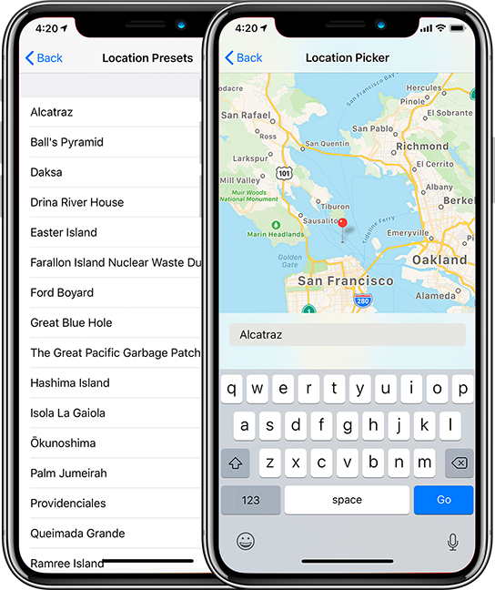

# LocationSpoofer

[](https://cocoapods.org/pods/LocationSpoofer)
[](https://cocoapods.org/pods/LocationSpoofer)
[](https://github.com/buglife/LocationSpoofer/blob/master/LICENSE)
[](https://twitter.com/buglifeapp)

LocationSpoofer is an iOS library for spoofing / mocking location, without changing any of your existing CoreLocation code.

## Installation

LocationSpoofer is available through [CocoaPods](https://cocoapods.org). To install
it, simply add the following line to your Podfile:

```ruby
pod 'LocationSpoofer'
```

## Usage

To spoof your current location, simply set the `location` property on `LocationSpoofer` to a non-nil value:

```swift
/// Swift
let alcatraz = CLLocation(latitude: 37.825944, longitude: -122.422398)
LocationSpoofer.shared.location = alcatraz
```

```objc
/// Objective-C
CLLocation *alcatraz = [[CLLocation alloc] initWithLatitude:37.825944 longitude:-122.422398];
[LOSPLocationSpoofer sharedSpoofer].location = alcatraz;
```

### Geocoding helpers

Can't be bothered to look up the exact latitude / longitude? LocationSpoofer has helpers for that:

```swift
/// Swift
let address = "1 Telegraph Hill Blvd, San Francisco, CA 94133"
CLLocation.losp_get(withAddress: address) { location, error in
	guard let location = location else {
		print("Error: \(String(describing: error))")
		return
	}
	LocationSpoofer.shared.location = location
}
```

```objc
/// Objective-C
NSString *address = @"1 Telegraph Hill Blvd, San Francisco, CA 94133";
[CLLocation losp_getLocationWithAddress:address completion:^(CLLocation *location, NSError *error) {
    if (error) {
        NSLog(@"Error: %@", error);
    }
    
    [LOSPLocationSpoofer sharedSpoofer].location = location;
}];
```

### Trips

LocationSpoofer can spoof trips, i.e. a moving location between a start & end coordinate.

```swift
/// Swift
let startAddress = "1150 Lombard St, San Francisco"
let endAddress = "950 Lombard St, San Francisco"
Trip.getWithStartAddress(startAddress, endAddress: endAddress, duration: 10) { trip, error in
	guard let trip = trip else {
		print("Error: \(String(describing: error))")
		return
	}
	LocationSpoofer.shared.location = trip
}

```objc
/// Objective-C
NSString *startAddress = @"1150 Lombard St, San Francisco";
NSString *endAddress = @"950 Lombard St, San Francisco";
[LOSPTrip getTripWithStartAddress:startAddress endAddress:endAddress duration:10 completion:^(LOSPTrip *trip, NSError *error) {
    if (error) {
        NSLog(@"Error: %@", error);
    }
    
    [LOSPLocationSpoofer sharedSpoofer].location = trip;
}];
```

### Disable location spoofing

To disable location spoofing, simply set the `location` property on `LocationSpoofer` to `nil`.

```swift
/// Swift
LocationSpoofer.shared.location = nil
```

```objc
/// Objective-C
[LOSPLocationSpoofer sharedSpoofer].location = nil;
```

### Debug view controller

LocationSpoofer provides a UI for spoofing location; you may choose to embed this in your app's debug menu if you have one, or via a custom gesture.

```swift
/// Swift
let vc = LocationDebugViewController()
present(vc, animated: true)
```

```objc
/// Objective-C
LOSPLocationDebugViewController *vc = [[LOSPLocationDebugViewController alloc] init];
[self presentViewController:vc animated:YES completion:nil];
```



## Authors

LocationSpoofer is built by the [Buglife](https://buglife.com) team, and we hope it saves you some unnecessary driving :)

## License

LocationSpoofer is available under the MIT license. See the LICENSE file for more info.
